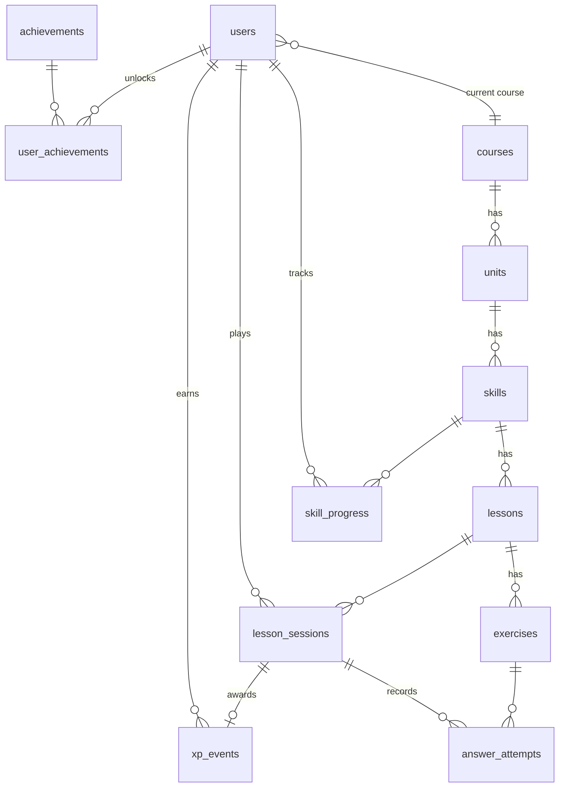

# Duolingo Clone

A full-stack clone of the Duolingo web app. You can work through a winding learning path, complete lessons made of six interactive exercise types, earn XP, keep a daily streak, lose and regain hearts, climb a weekly league and unlock achievements, all in Duolingo's playful UI.

- **Live demo:** https://duolingo-clone-chi-lovat.vercel.app
- **API:** https://k9915.pythonanywhere.com (interactive docs at [/docs](https://k9915.pythonanywhere.com/docs))
- **Source:** https://github.com/k9927/duolingo-clone

> **Disclaimer:** an educational project built for a hiring assignment. It is not affiliated with or endorsed by Duolingo. The Duolingo name, logo, characters and artwork belong to Duolingo; they are loaded from Duolingo's own servers and are not included in this repository.

---

## Tech stack

| Layer | Technology |
|---|---|
| Frontend | Next.js 16 (App Router) with TypeScript, Tailwind CSS v4, Motion (animations), lottie-react (Duolingo's Lottie animations), in `frontend/` |
| Backend | Python 3.12, FastAPI, SQLAlchemy 2 (ORM), Pydantic v2 (validation), Uvicorn, in `backend/` |
| Database | SQLite with a custom relational schema (12 tables), seeded automatically on first start |
| Testing | pytest + FastAPI TestClient (unit tests for game rules, end-to-end API tests for the lesson loop) |
| Audio | Duolingo's recorded clips where available, otherwise the browser's Web Speech API |
| Hosting | Frontend on Vercel, backend on Render (`render.yaml`) |

---

## Features

### Core
| Area | What's implemented |
| --- | --- |
| **Learning path** | One sticky colour banner that switches to the unit being scrolled through, unit dividers, a winding node path, locked/active/completed/legendary states, a progress ring around the active skill (lessons completed out of total, also shown as "Lesson X of Y" in its popover), checkmarks on completed skills and gold nodes for legendary ones, reward chests, unit trophies, a "JUMP HERE?" node on each locked unit, a Guidebook page per unit (`/guidebook/:unitId`) with key phrases in speech bubbles and grammar tips with tables and audio examples, and a mascot beside the path |
| **Top bar** | Course flag, streak, total XP, gems and hearts, each with a Duolingo-style hover panel (streak calendar, XP towards the daily goal, gem count, heart refill and practice). Duolingo itself has no XP counter here; it is included because the brief lists it |
| **Lesson player** | 6 exercise types (below), an animated progress bar, the green/red feedback bar with "Correct solution", SKIP, keyboard shortcuts (1–9 to pick, Enter to check/continue), wrong answers re-queued at the end ("Previous mistake"), "N in a row" combo, mid-lesson owl interludes ("Let's review the exercise you missed!", "Super impressive!"), and a quit confirmation |
| **Exercise types** | Multiple choice (image cards + "select the correct meaning"), translate with a word bank (ES→EN and EN→ES), match pairs, fill in the blank, type the answer (accent- and typo-tolerant, with an on-screen accent keyboard), and listen & tap (text-to-speech, with a slow 🐢 button) |
| **Hearts** | You lose a heart for each mistake in a lesson. They regenerate 1 per 60 min (lazy, computed server-side). You can refill with gems or practise to earn a heart back. An "out of hearts" sheet blocks the lesson at 0 |
| **XP & streak** | 10 XP per lesson +5 for a perfect lesson, practice 10 XP, legendary 40 XP, unit test 20 XP. The streak extends on the first XP of each local day. Streak freezes cover missed days |
| **Daily goal** | Selectable goal (10/20/30/50 XP), a Quests page in Duolingo's signed-in layout ("Welcome Back!" banner, the "Earn N XP" daily quest with progress bar and chest, "More quests unlock soon") |
| **Leaderboard** | Bronze League with weekly XP across 14 seeded learners: Duolingo's league badges and medals, a promotion zone (Bronze has no demotion), and a "Set your status" emoji picker whose emoji shows next to the learner on the board |
| **Profile** | Duolingo's signed-in profile: photo banner with edit button, name, username, join date, following/followers, the dismissible LinkedIn card, Statistics (day streak, total XP, league with week tag, top 3 finishes) and tiered achievement badges with progress (VIEW ALL). The right panel shows Following/Followers and Add friends |
| **Settings & help** | Duolingo's Preferences page: Sound effects, Animations (Lottie animations freeze when off), Motivational messages (mid-lesson cheers) and Listening exercises (listen questions are skipped), plus a Dark mode dropdown. Duolingo's settings menu in the right panel (Account, Subscription and Support cards); Profile holds the name and daily goal. The MORE menu (English Test, Settings, Help, Log out) and a Help Center FAQ page |
| **Celebrations** | Duolingo's post-lesson sequence: Lesson Complete (one of 9 random character animations, odometer-style TOTAL XP / accuracy counters) → streak screen with the week calendar → course-score progress (1 point per 100 XP) → daily-quest progress bars → daily-goal gem chest (+5 gems the first time the goal is hit each day) → "Prove you're a legend" offer when a skill is finished. Plus mid-lesson Duo cheers, achievement toasts and Duolingo's own sound effects |
| **Persistence** | All progress (XP, streak, hearts, gems, skill progress, sessions, achievements) is stored per user in SQLite |

### Bonus features
- **Audio:** Duolingo-style exercise audio. Spanish sentences are read aloud when an exercise appears (with a replay button), Spanish word tiles, match pairs, picture cards and blank choices speak when tapped, listening exercises have normal and slow (🐢) playback, and the Spanish answer is read back after a correct English→Spanish translation, typed answer or filled blank. Recorded Duolingo clips are used where a word has one; everything else uses the browser's text-to-speech with a native Spanish voice when installed
- **Word hints:** like Duolingo, every word of an exercise sentence has a dashed underline. Hovering (or tapping) a word shows its meaning in the sentence plus an example sentence that uses it (with the translation), and hovering or clicking a Spanish word reads it aloud. Phrases such as *buenos días* or *por favor* are hinted as one unit. Hints work for Spanish sentences (English meanings) and English sentences (Spanish meanings); the server splits each sentence into tokens (`services/word_hints.py`, dictionary in `seed/hints.py`)
- **Achievements:** Wildfire, Sage, Scholar, Sharpshooter, Conqueror and Legendary, each with gem rewards
- **Leaderboard:** a working league ranked from the real XP ledger across seeded users
- **Timed "Legendary" challenge:** 3 minutes and 3 mistakes, and it turns the node gold
- **"Jump here?" unit test:** the first node of each locked unit opens Duolingo's splash ("Pass this test to jump ahead to Unit N!"), then a 10-question test on the earlier units with 3 mistakes allowed. Passing completes every earlier skill and unlocks that unit
- **Dark mode:** follows the system by default, like Duolingo, or can be forced to light or dark. Both themes use colour tokens measured from duolingo.com, including dark mode's lime buttons with dark text
- **Responsive layout:** 3 columns on desktop, an icon sidebar on tablet, and a top stats bar with bottom tabs on mobile

### Extra Duolingo sections
- **Sounds:** Spanish vowels and consonants as tappable tiles. Each tile plays its example word, and START +10 XP opens a practice round.
- **Practice hub:** Duolingo's layout: a "Today's Review" Target Practice banner (UNLOCK, a Super feature, so it shows a coming-soon message), Conversation (Speak, Listen) and Your collections (Mistakes, which starts a practice session, and Stories), with Duolingo's artwork and SUPER badges. Practice is also reachable from the hearts menu and the out-of-hearts dialog.
- **Sidebar MORE menu**, the "Want to learn chess?" promo and the "Try Super for free" card, matching Duolingo's layout.

### Placeholders ("Coming soon")
Shown as a "coming soon" message, as the brief allows:
- **Speech recognition / pronunciation:** the Speak practice card (exercise audio itself is implemented)
- **Super subscription and purchases:** Try Super / free-trial buttons, Unlimited Hearts, Target Practice UNLOCK; gems are mocked and earned in-app
- **Friends and social:** follow, find and invite friends, Friend Streaks, LinkedIn sharing (the leaderboard is seeded with 13 learners)
- **Multiple languages:** Courses settings and "More courses" in the course menu; one seeded course (Spanish)
- **Authentication:** a single default learner is always signed in; Log out shows a message
- **Other:** notifications, social accounts and privacy settings, Listen and Stories practice, lesson review, chess

---

## Getting started

### Prerequisites
- Python 3.11+ (3.12 recommended)
- Node.js 20+

### 1. Backend (port 8000)
```bash
cd backend
python -m venv .venv
# Windows: .venv\Scripts\activate    macOS/Linux: source .venv/bin/activate
pip install -r requirements-dev.txt
uvicorn app.main:app --reload --port 8000
```
On first start it creates `duolingo.db` and seeds it. Interactive API docs are at http://localhost:8000/docs.

To reset the database at any time:
```bash
python -m app.seed.seed --reset
```

### 2. Frontend (port 3000)
```bash
cd frontend
cp .env.example .env.local      # NEXT_PUBLIC_API_URL=http://localhost:8000
npm install
npm run dev
```
Open http://localhost:3000.

### Tests
```bash
cd backend
pytest
```
33 tests cover streak, heart and grading rules, plus end-to-end API flows: a full lesson, mistakes, running out of hearts, practice, refill, locked skills, time travel, legendary, unit tests (jump ahead), the daily-goal gem chest, guidebook, leaderboard status, the listening-exercises preference, word hints, leaderboard and profile.

### Trying the time-based mechanics
**Demo tools** at `/settings/demo` (linked from Settings → Profile and the Help Center) lets you:
- **Simulate next day / Go back one day.** This shifts the learner's clock to test streak extension, streak loss and streak freezes.
- **Empty hearts.** This shows the out-of-hearts flow.
- **Reset demo data.** This restores the seeded state.

---

## Architecture

```
┌────────────────────────── Next.js (client-rendered) ──────────────────────────┐
│ app/(main)/learn|leaderboard|quests|shop|profile|settings  ← AppShell layout   │
│ app/lesson|practice|legendary/[skillId]                    ← full-screen player│
│ components/  path/ lesson/ lesson/exercises/ shell/ ui/ providers/ mascot/     │
│ lib/api.ts (typed fetch client) · lib/types.ts (mirrors API schemas)           │
└───────────────────────────────────┬────────────────────────────────────────────┘
                                    │ JSON over HTTP (CORS)
┌───────────────────────────────────▼──────────────── FastAPI ───────────────────┐
│ routers/   me · course · sessions · leaderboard · shop · dev   (thin HTTP layer)│
│ services/  sessions (lesson loop) · grading · hearts · streak · progress ·      │
│            achievements · clock · users        (business rules, no HTTP)        │
│ models.py (SQLAlchemy ORM) · schemas.py (Pydantic contract) · seed/             │
└───────────────────────────────────┬────────────────────────────────────────────┘
                                    ▼
                               SQLite (duolingo.db)
```

**Design decisions**
- **The server is the authority.** Answer keys (`exercises.solution`) are never sent to the client. Every answer is graded by the API, and the API deducts hearts, awards XP and advances progress. The client can't fake completion: `/complete` checks that every exercise in the session has a correct attempt.
- **Lazy time-based rules.** Heart regeneration and streak breaks are computed whenever the user is loaded (`deps.get_current_user`), so there are no cron jobs. All time reads go through `services/clock.py`, which applies the learner's timezone and the simulated `day_offset`. That keeps day logic testable, as the brief requires.
- **XP ledger.** Every XP gain is a row in `xp_events` with the learner's local `activity_date`. The daily goal, quests, weekly league and XP chart are all aggregate queries on it, and `users.total_xp` is a denormalised running total.
- **Mistakes are re-queued** on the client, as in Duolingo. The progress bar counts unique exercises solved.
- **Layering.** Routers only translate HTTP to and from service calls. Services raise `DomainError` (code + message), which a single exception handler turns into `{code, message}` JSON. The frontend reacts to codes such as `out_of_hearts`.
- **Frontend state.** A `UserProvider` holds the learner summary (`/api/me`), which the top bar, right panel and popovers read. Pages fetch their own data with a small `useResource` hook, and mutations return the updated summary.

---

## Database schema



| Table | Purpose | Key columns |
| --- | --- | --- |
| `courses` | A language course | `code` (unique, e.g. `es-en`), `learning_language`, `from_language`, `flag` |
| `units` | Section of the path | `course_id` FK, `position` (unique per course), `title`, `color`, `guidebook` (JSON: key phrases, plus tips with title, body, optional table and examples) |
| `skills` | A node on the path | `unit_id` FK, `position` (unique per unit), `title`, `icon` |
| `lessons` | A level of a skill (a crown) | `skill_id` FK, `position` (unique per skill) |
| `exercises` | One exercise | `lesson_id` FK, `position`, `type` (enum of 6), `prompt`, `data` (JSON the client renders), `solution` (JSON answer key, server-only) |
| `users` | Learner and game state | `total_xp`, `gems`, `hearts` + `hearts_updated_at`, `streak`, `longest_streak`, `last_streak_date`, `streak_freezes`, `daily_goal_xp`, `timezone`, `theme`, `sound_effects`, `day_offset`, `status` (leaderboard emoji) |
| `skill_progress` | Per-user progress per skill | `(user_id, skill_id)` unique, `lessons_completed`, `is_legendary`, `completed_at` |
| `lesson_sessions` | One attempt (lesson / practice / legendary / unit_test) | `kind`, `status` (in_progress/completed/failed/abandoned), `lesson_id`, `exercise_ids` (JSON, ordered), `mistakes`, `xp_earned`, timestamps |
| `answer_attempts` | Every submitted answer | `session_id` FK, `exercise_id` FK, `submitted` (JSON), `is_correct` |
| `xp_events` | XP ledger | `user_id`, `session_id`, `amount`, `source`, `activity_date` (indexed with user) |
| `achievements` | One row per achievement tier | `(code, level)` unique, `metric`, `threshold`, `gem_reward` |
| `user_achievements` | Unlocked tiers | `(user_id, achievement_id)` unique, `unlocked_at` |

Foreign keys are enforced (`PRAGMA foreign_keys=ON`), and content cascades on delete. Skill lock state is **derived** from `skill_progress` rather than stored: skills unlock strictly in order, so it can never go out of sync.

### Exercise `data` / `solution` shapes
| type | `data` (sent to client) | `solution` | answer payload |
| --- | --- | --- | --- |
| `multiple_choice` | `choices[{id,text,image?}]`, `variant`, `sentence?` | `{choice_id}` | `{choice_id}` |
| `translate` | `sentence`, `sentence_lang`, `words[]` | `{accepted[]}` | `{tokens[]}` |
| `listen` | `audio_text`, `words[]` | `{accepted[]}` | `{tokens[]}` |
| `match_pairs` | `pairs[{id,left,right}]` | – | `{matches[{left,right}]}` |
| `fill_blank` | `before`, `after`, `translation`, `choices[]` | `{answer}` | `{choice}` |
| `type_answer` | `sentence`, `sentence_lang` | `{accepted[]}` | `{text}` |

---

## API overview

All endpoints are under `/api`. Errors return `{ "code": "...", "message": "..." }`. Full OpenAPI docs are at `/docs`.

| Method | Path | Description |
| --- | --- | --- |
| GET | `/me` | Learner summary: XP, gems, hearts (+ next heart time), streak, today's XP/lessons, settings |
| PATCH | `/me/settings` | Update name, daily goal, sound effects, animations, motivational messages, listening exercises, theme, timezone |
| PUT | `/me/status` | Set or clear (`null`) the leaderboard status emoji |
| GET | `/me/profile` | Stats, achievements with progress, 7-day XP history |
| GET | `/courses` | Available courses |
| GET | `/path` | Units → skills with state and lesson progress for the current course |
| GET | `/units/{id}/guidebook` | Unit number, key phrases and structured grammar tips |
| POST | `/sessions` | Start a session `{kind: lesson\|practice\|legendary\|unit_test, skill_id?}` (for `unit_test`, `skill_id` is the first skill of the unit to jump to). Returns exercises without answers, with word-hint tokens for their sentences |
| POST | `/sessions/{id}/answers` | Grade an answer `{exercise_id, answer}`. Returns correctness, solution, hearts and status |
| POST | `/sessions/{id}/complete` | Finish: awards XP, updates streak/progress/achievements and returns the results screen data |
| POST | `/sessions/{id}/abandon` | Quit a session |
| GET | `/leaderboard?period=week\|all` | Ranked league entries |
| GET | `/shop/items` | Heart refill and streak freeze with availability |
| POST | `/shop/purchase` | Buy `{item_id: heart_refill\|streak_freeze}` with gems |
| POST | `/dev/time-travel` | Shift the learner's clock by `{days}` |
| POST | `/dev/set-hearts` | Force a heart count |
| POST | `/dev/reset` | Drop and reseed the database |
| GET | `/health` | Health check |

Error codes used by the UI include `out_of_hearts`, `skill_locked`, `session_incomplete`, `not_enough_gems`, `hearts_full` and `time_up`.

---

## Seed data
- **Course:** Spanish for English speakers, with 3 units and 10 skills. Unit 1 ("Order at a café") opens with Duolingo's own first three lessons, including their illustrations and recorded voices (`backend/app/seed/duolingo_lessons.json`). The rest have 3 lessons per skill. That is 27 lessons and 216 exercises, generated deterministically from vocabulary, sentences and fill-in-the-blank items in `backend/app/seed/content.py` and `builder.py`.
- **Learner "Alex" (`learner`):**
  - 2 skills finished and 1 lesson into the third
  - 90 XP, 500 gems and 4/5 hearts
  - A **4-day streak ending yesterday**, so the first lesson today visibly extends it to 5
  - Several achievements already unlocked; the next lesson crosses 100 XP and unlocks *Sage*
- **League:** 13 rival learners with XP this week (a few with status emojis).

---

## Assumptions
- **Authentication is simplified** (allowed by the brief). Every request acts as the default seeded learner. An `X-User-Id` header can select another user, so the data model is fully multi-user.
- **One course** (Spanish) is seeded. The schema supports more.
- **Days are local to the learner's timezone** (default `Asia/Kolkata`, configurable via `DEFAULT_TIMEZONE`). Weekly leagues run Monday to Sunday.
- **Gems are mocked.** You start with 500 and earn more from achievements. A heart refill costs 350 and a streak freeze 200 (max 2 equipped). The shop follows Duolingo's layout, including the Super trial banner and "Unlimited Hearts", which show a coming-soon message.
- **Audio** plays Duolingo's own recordings for words that have them and falls back to the browser's Web Speech API, so fallback voices depend on the OS and browser. Sound effects (correct, wrong, lesson complete, failed) are Duolingo's own clips.
- **Official Duolingo artwork, font and animations are used, as the brief asks for an exact match.** They are not stored in this repo. Pages load them from Duolingo's CDN through same-origin rewrites in `frontend/next.config.ts` (`/duo-cdn`, `/duo-simg`); the rewrites are needed because fonts and Lottie JSON require CORS. The list of assets lives in `frontend/src/lib/duoAssets.ts`. If a file can't load, my own SVG owl is shown instead.
- **Match-pairs mismatches don't cost hearts.** They flash red, as in Duolingo.

---

## Deployment

The live demo runs the frontend on **Vercel** and the API on **PythonAnywhere**. Both have free plans that need no card, and PythonAnywhere keeps the SQLite file on a persistent disk, so progress survives restarts.

**Backend → PythonAnywhere** (free "Beginner" account)
1. In a **Bash console**:
   ```bash
   git clone https://github.com/k9927/duolingo-clone.git
   mkvirtualenv --python=python3.12 duo
   pip install -r duolingo-clone/backend/requirements.txt
   ```
2. **Web** tab → *Add a new web app* → *Manual configuration* → *Python 3.12*.
3. Set **Virtualenv** to `/home/<username>/.virtualenvs/duo`.
4. Open the **WSGI configuration file** and replace its contents with:
   ```python
   import sys
   sys.path.insert(0, "/home/<username>/duolingo-clone/backend")
   from wsgi import application  # noqa: E402
   ```
   `backend/wsgi.py` wraps the FastAPI (ASGI) app with `a2wsgi`, because the free plan serves WSGI apps, and creates and seeds the database on first start.
5. Click **Reload**. The API is live at `https://<username>.pythonanywhere.com` (the root redirects to `/docs`). To update later: `git pull` in the console, then **Reload**.

`*.vercel.app` origins are allowed by `CORS_ORIGIN_REGEX`; add any other frontend origin to `CORS_ORIGINS`.

**Frontend → Vercel**
1. Import the GitHub repo and set the **Root Directory** to `frontend`.
2. Add the environment variable `NEXT_PUBLIC_API_URL=https://<username>.pythonanywhere.com`.
3. Deploy.

**Other hosts.** `render.yaml` (Render, uvicorn) and `backend/Dockerfile` (any Docker host, including Hugging Face Spaces) are included as alternatives. Those platforms' free tiers have ephemeral disks, so the database is re-seeded on each restart; point `DATABASE_URL` at a mounted volume to keep progress.

---

## Project structure
```
backend/
  app/
    main.py            FastAPI app, CORS, error handler, startup seeding
    config.py          Settings (env-overridable game constants)
    database.py        Engine/session, SQLite FK pragma
    models.py          ORM schema
    schemas.py         Pydantic request/response models
    deps.py            DB session + current-user dependency (lazy hearts/streak sync)
    routers/           me, course, sessions, leaderboard, shop, dev
    services/          sessions, grading, hearts, streak, progress, achievements, clock, users
    seed/              content.py (course data), builder.py (exercise generator), seed.py
  tests/               rule unit tests + API flow tests
frontend/
  src/app/             routes: (main)/learn, leaderboard, quests, shop, profile, settings (preferences, profile, demo); help; lesson/, practice/, legendary/, jump/, (main)/guidebook
  src/components/      shell/ (sidebar, stats bar, right panel), path/, lesson/ (+ exercises/), ui/, mascot/, providers/
  src/lib/             api client, types, hooks, sounds, speech, colour helpers
```
